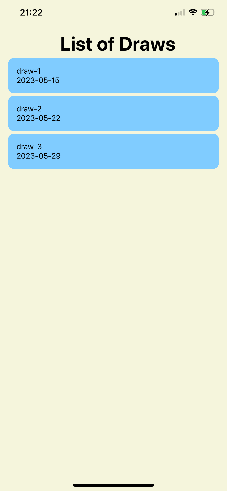
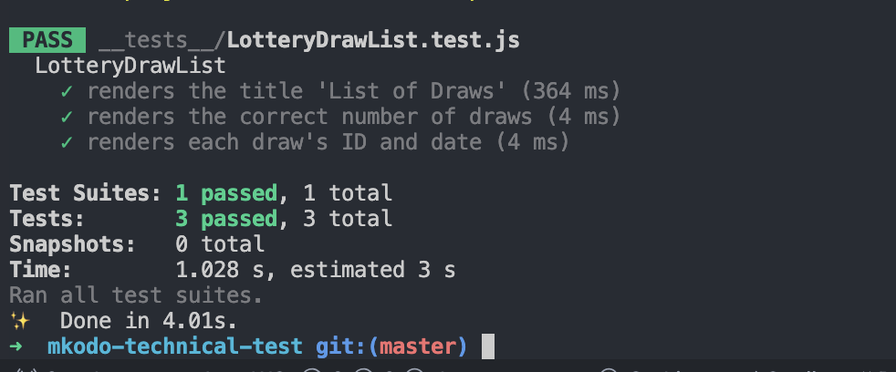

# Lottery Draw App - mKodo Technical Test

This app displays a list of lottery draws, allowing users to view details about each draw, including the draw numbers and bonus ball. It is built using React Native and can be run using Expo.

## Features

- Parse and display JSON data of lottery draws.
- Show a list of draws with their respective dates.

## Getting Started

### Prerequisites

- **Node.js**: Make sure you have Node.js installed. You can download it from [here](https://nodejs.org/).
- **Expo CLI**: Install Expo CLI globally using npm:
  ```bash
  npm install -g expo-cli
  ```

### Installation

1. Clone the repository:
   ```bash
   git clone https://github.com/usuu03/mkodo-technical-test.git
   ```
2. Navigate to directory
   ```bash
   cd app
   ```
3. Install the dependencies:
   ```bash
   yarn install
   ```

### Running the App

1. Start the Expo server:
   ```bash
   npx expo start
   ```
2. Use the Expo Go app on your iOS or Android device to scan the QR code displayed in your terminal or browser. This will load the app on your device.

### Testing

Unit and integration tests are included to ensure the app's core functionalities work as expected.

To run the tests, use the following command:

```bash
npm test or yarn test
```

This will execute the test cases located in the `__tests__` directory and display the results.

### App Preview

Here’s how the app should look on an iPhone device:



Here are the test results:



Here is the video proof:

[Watch the Video](./assets/video.MP4)

### Notes

- Ensure your device and computer are connected to the same network when using the Expo Go app.
- If you encounter issues with the app not loading, try restarting the Expo server or reinstalling the Expo Go app.

---
